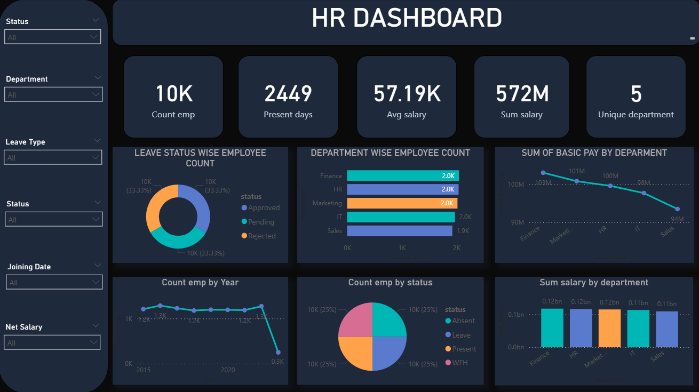

# 📊 HR Analytics Dashboard – Power BI

## 📌 Project Overview

This project presents an interactive HR Analytics Dashboard built using Power BI. It helps analyze employee data such as attendance, salary distribution, department performance, and workforce status.

The dashboard enables HR teams to make data-driven decisions and monitor workforce trends effectively.

---

## 🎯 Business Problem

Managing employee performance, attendance, and salary insights manually is difficult and time-consuming. This dashboard provides a centralized solution to track key HR metrics efficiently.

---

## 🗄️ Data Source

The dataset for this project was extracted from a SQL database and connected directly to Power BI.

---

## 🔗 Data Connection Process

* Connected Power BI to SQL database
* Imported required tables into Power BI
* Performed data cleaning using Power Query
* Created relationships between tables
* Built calculated columns and measures

---

## 🛠️ Tools & Technologies

* Power BI
* SQL

---

## 📊 Key Metrics

* Total Employees: 10K
* Average Salary: 57.19K
* Total Salary: 572M
* Present Days: 2449
* Departments: 5

---

## 📈 Dashboard Features

* Interactive filters (Department, Status, Leave Type, Joining Date, Salary)
* Employee count by department
* Salary distribution across departments
* Leave status analysis (Approved, Pending, Rejected)
* Workforce status breakdown (Present, Absent, WFH, Leave)
* Year-wise employee trend

---

## 📷 Dashboard Preview



---

## 🧾 Sample SQL Query

```sql
SELECT 
    department,
    COUNT(employee_id) AS total_employees,
    AVG(salary) AS avg_salary
FROM employees
GROUP BY department;
```

---

## 📁 Project Structure

HR-Analytics-Dashboard-PowerBI/
│
├── HR_Analytics_Dashboard.pbix
├── HR_Dashboard.png
├── hr_database.sql
└── README.md

---

## 🚀 How to Use

1. Download the `.pbix` file
2. Open using Power BI Desktop
3. Explore the dashboard using filters

---

## 🔍 Key Insights

* Employee distribution is balanced across departments
* Salary variation is slightly higher in Finance compared to other departments
* Workforce status categories are evenly distributed
* Leave approvals remain consistent across categories

---

## 🔗 Future Improvements

* Add employee attrition analysis
* Include predictive analytics
* Improve dataset realism

---

## 👤 Author

Lokesh M K
